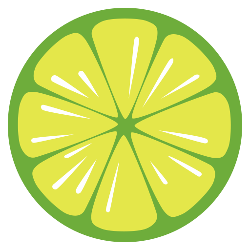
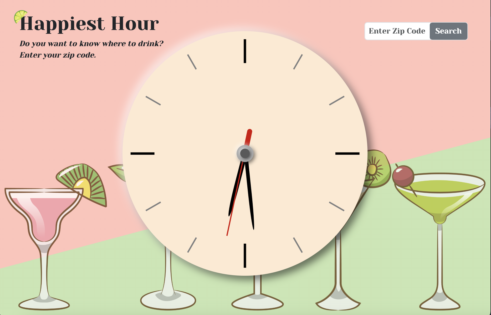
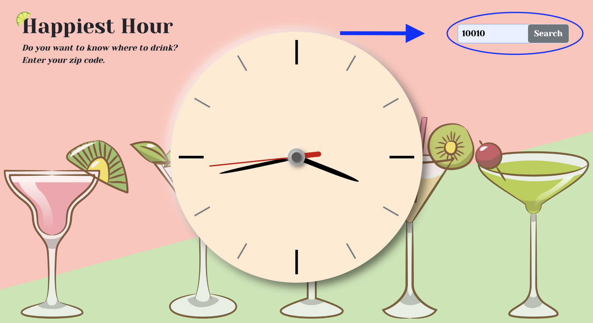
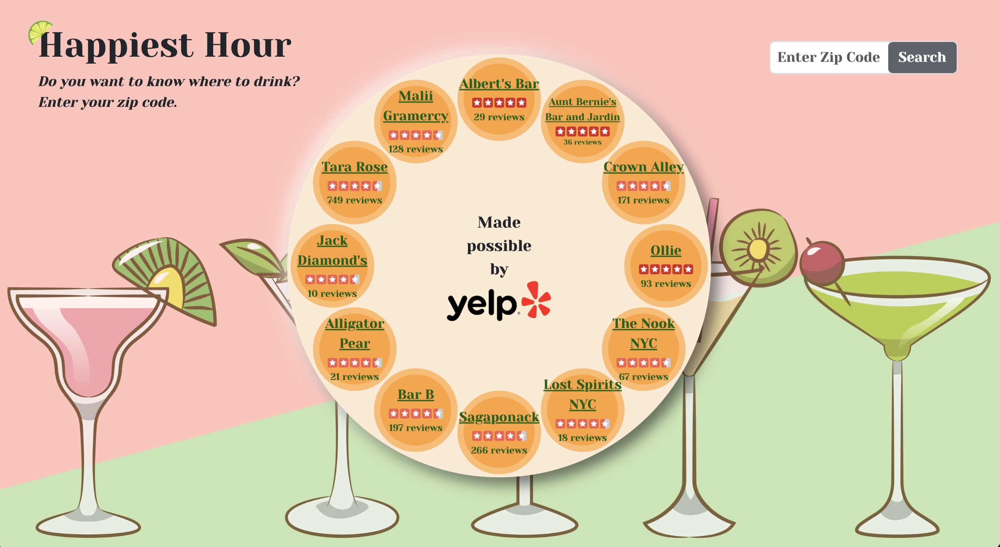

[![Contributors][contributors-shield]][contributors-url]

<!--  -->

  

<h3 style="text-align:center;">Happiest Hour</h3>

  

    This project creates a cohesive and intuitive interface which people can use to find the "happiest" hours in any zip code.
     
    <a href="https://github.com/ColdWeatherBoyy/happiest-hour"><strong>Explore the docs »</strong></a>
     
  

  
Table of Contents

  <ol>
    <li>
      <a href="#about-the-project">About The Project</a>
      <ul>
        <li><a href="#built-with">Built With</a></li>
      </ul>
    </li>
    <li><a href="#installation">Installation</a></li>
    <li><a href="#usage">Usage</a></li>
    <li><a href="#roadmap">Roadmap</a></li>
    <li><a href="#contributing">Contributing</a></li>
    <li><a href="#license">License</a></li>
    <li><a href="#contact">Contact</a></li>
    <li><a href="#acknowledgments">Acknowledgments</a></li>
  </ol>

## About the Project

This project was created as a fun and creative way to gather highly rated bar names & links (from one area) in one space. Happiest Hour began as a fully functioning application with a complete backend and basic HTML frontend. Elias and Liza partnered to integrate the backend to a user-friendly UI. They also wanted to continue challenging themselves after gratuating from a fullstack web development bootcamp - the clock posed many UI and functionality challenges in terms of geometry, syncronicity, and UX.

Overall, they learned much about React and how to leverage props, writing clean code, and working with a symmetrical, functional element such as a clock.

## Built With

- 
- 
- 
- 
- 
- 
- 
- 

## Installation

## Usage

Simply visit [this link](https://happiest-hour-cb7f5c7640b4.herokuapp.com/) to access Happiest Hour.

To use Happiest Hour, enter your desired zip code in the search field:

The search field appears in the top right corner on desktop & tablets. On mobile, it appears beneath the clock.

Upon clicking enter, the clock will populate with the top 12 happy hours in that area.

## Roadmap

## Contributing

## License
Distributed under the MIT License. See `LICENSE` for more information.

## Contact

Elias Spector-Zabusky - [LinkedIn](https://www.linkedin.com/in/elias-sz/) - elias.spector.zabusky@gmail.com   
Liza Parr - [LinkedIn](https://www.linkedin.com/in/lizajparr/) - lizajparr@gmail.com

Project Link: [https://github.com/ColdWeatherBoyy/happiest-hour](https://github.com/ColdWeatherBoyy/happiest-hour)

## Acknowledgements
* 
* 
* [Othneil Drew](https://github.com/othneildrew) 

<!--
## Credits

This project was a collaboration between [Elias Spector-Zabusky](https://github.com/ColdWeatherBoyy) and [Liza Parr](https://github.com/lparr30). Click their names to view their GitHub profiles.

insert useWindowDimension contribution, lime icons, cocktail icons

If you used any third-party assets that require attribution, list the creators with links to their primary web presence in this section.

If you followed tutorials, include links to those here as well.

## License

The last section of a high-quality README file is the license. This lets other developers know what they can and cannot do with your project. If you need help choosing a license, refer to [https://choosealicense.com/](https://choosealicense.com/).

---

🏆 The previous sections are the bare minimum, and your project will ultimately determine the content of this document. You might also want to consider adding the following sections.

## Badges

Badges aren't necessary, per se, but they demonstrate street cred. Badges let other developers know that you know what you're doing. Check out the badges hosted by [shields.io](https://shields.io/). You may not understand what they all represent now, but you will in time.

## Features

If your project has a lot of features, list them here.

## How to Contribute

If you created an application or package and would like other developers to contribute it, you can include guidelines for how to do so. The [Contributor Covenant](https://www.contributor-covenant.org/) is an industry standard, but you can always write your own if you'd prefer.

## Tests

Go the extra mile and write tests for your application. Then provide examples on how to run them here.
 -->

<!-- Markdown links & images -->

[contributors-shield]: https://img.shields.io/github/contributors/ColdWeatherBoyy/happiest-hour.svg?style=for-the-badge
[contributors-url]: https://github.com/ColdWeatherBoyy/happiest-hour/graphs/contributors
